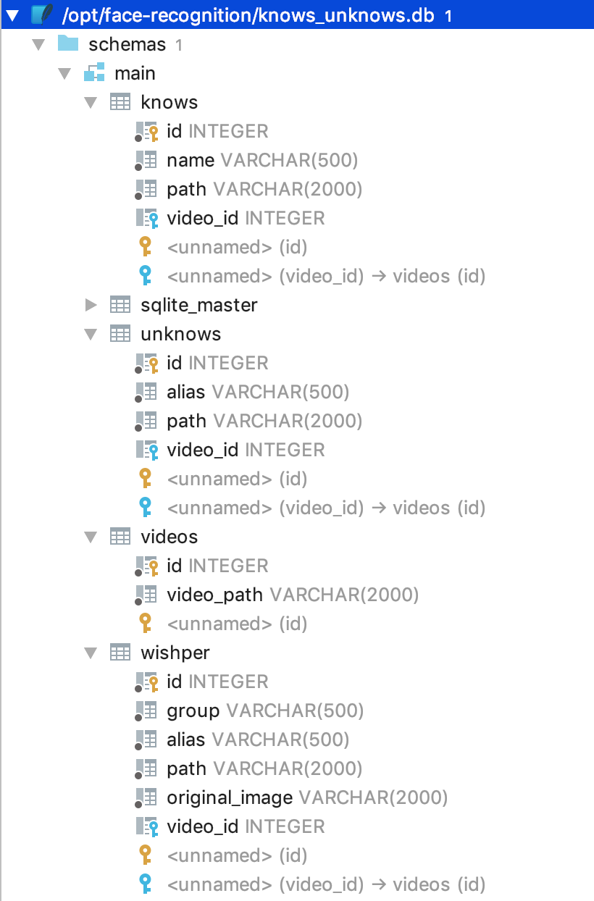

# Video facial recognition with Storm topology


---
 <p align="justify">Cesar Jimenez Zapata @cesarjz and Francisco Jesus Gomez Rodriguez @ffranz </p>

---

**This project is a Proof Of Concepts (POC)  and it is not ready to 
production enviroment**

**THE SOFTWARE IS PROVIDED "AS IS", WITHOUT WARRANTY OF ANY KIND, EXPRESS OR
IMPLIED, INCLUDING BUT NOT LIMITED TO THE WARRANTIES OF MERCHANTABILITY,
FITNESS FOR A PARTICULAR PURPOSE AND NONINFRINGEMENT. IN NO EVENT SHALL THE
AUTHORS OR COPYRIGHT HOLDERS BE LIABLE FOR ANY CLAIM, DAMAGES OR OTHER
LIABILITY, WHETHER IN AN ACTION OF CONTRACT, TORT OR OTHERWISE, ARISING FROM,
OUT OF OR IN CONNECTION WITH THE SOFTWARE OR THE USE OR OTHER DEALINGS IN THE
SOFTWARE.**

## Presentation

We talk in this document about facial recognition and video processing. In this
 document we will try to
show you which are the latest trends in facial recognition and the technology
behind this type of work.

We will talk about OSINT, video analysis, facial recognition and how to find
faces in images and videos, how to encode these faces so that a computer
understands them, how to identify people in these videos and we will see a
demonstration of all this in operation with a possible architecture hardware and
software that can be used for fast and effective processing. In a second phase
we will see the code that makes this possible in Java and Python, and finally we
will talk about how we can classify the people that appear in the videos which
have not been identified. In a final appendix we will also see some ways to
defend against this type of identifications, we will see that some of them are
quite daring to use on a daily basis, and thus avoid these automatic facial
recognition systems.

OSINT is a series of techniques, technologies and methodologies that are used to
obtain intelligence information from various open sources, understood as open to
the public. This type of information is very common nowadays because social
networks and the different services and web pages that people use to communicate
, provide a great source of information. As you can see in 1992 

> "The official
> definition of OSINT by the U.S. Intelligence Community: By Open Source we 
refer
> to publicly available information appearing in print or electronic form. Open
> Source information may be transmitted through radio, television, and 
newspapers,
> or it may be distributed by commercial databases, electronic mail networks, or
> portable electronic media such as CDROM's. It may be disseminated to a broad
> public, as are the mass media, or to a more select audience, such as gray
> literature, which includes conference proceedings, company shareholder 
reports,
> and local telephone directories. Whatever form it takes, Open Source 
involves no
> information that is: classified at its origin; is subject to proprietary
> constraints (other than copyright); is the product of sensitive contacts with
> U.S. or foreign persons; or is acquired through clandestine or covert
> means."
>
> -- <cite>United States Marine Corps Comments on Joint Open Source Task Force 
            Report and Recommendations
             Working Group Draft Dated 6 January 1992,
             and portions, including the definition, were subsequently
             OSS NOTICES,
             Volume 2 Issue 9,
             30 November 1994</cite>

There was an official definition of what was understood
by OSINT given by the United States intelligence community.

A more modern definition could be that 
>OSINT is the data
>collection publicly available and used in an intelligence context.
>
> -- <cite>Wikipedia contributors. (2018, September 23). Open-source intelligence. In Wikipedia, The Free Encyclopedia. Retrieved 18:07, October 19, 2018, from https://en.wikipedia.org/w/index.php?title=Open-source\_intelligence\&oldid=860809738
</cite>
 

What is an
intelligence context? Well, 

> intelligence \cite{intelligencewiki} is the
> development of behaviour forecasts or recommended courses of action, for the
> leadership of an organisation, based on a wide range of open information
> available.

OSINT has been used in many cases, in issues of national security,
counterterrorism, cyber terrorist tracking, search for lost people,
identification of people in sexual crimes robberies and other crimes,
identification of people involved in crimes of identity theft. It is used in
companies to monitor the activity of the competition, or in the case of hackers,
to obtain information for a specific purpose. There are also
cases in which the analysis of videos is used to see the impact of a brand
(amount of time seen on television) at sporting events and thus calculate the
return on investment of sports sponsorship.
Others uses can be automated border processing system and prevent voter fraud

 Video analysis,
and in particular the recognition of people, is a very interesting task for
different security managers, CISOs and people with responsibilities in physical
security.

However, video and image are gaining importance on the Internet where content
grows exponentially in this type of formats. We believe that obtaining
information from these video sources should begin to take importance within the
techniques and technologies used in OSINT and we should be able to process and
analyze this type of information.

Video traffic has not stopped growing on the Internet and in 2018 it is
estimated that traffic circulating in video on the Internet is 90 million
terabytes per month, of this traffic approximately 2% is traffic that comes
from surveillance videos, which would give us 180,000 terabytes per month in
content of surveillance videos

One interesting article The FIVE report or  "NIST Interagency Report 8173: Face
In Video Evaluation (FIVE) Face Recognition of Non-Cooperative Subjects"
 say 
> "Face in Video Evaluation (FIVE), an independent, public
>test of face recognition of non-cooperating subjects who are recorded passively
>and are mostly oblivious to the presence of cameras" 
>
>"he report enumerates
>accuracy and speed of face recognition algorithms applied to the identification
>of persons appearing in video sequences drawn from six different video datasets
>mostly sequestered at NIST"

Governments and some private institutions have seen in this video analysis a
very valuable source of information and, to mention a few cases, the Chinese
government is known to have large projects of research in this field to allow
the control of its citizens and always obtain useful and valuable information
about their activities. We will talk about these social impacts at the end of
the presentation.

## Architecture 
All the work that
we are going to show here can be reproduced with the code that we will provide
and with the following tools or OpenSource libraries.

- We will use OpenCV, a software widely used in computer
vision that is developed by Intel and started in 1999. https://opencv.org/
- Apache storm is an Open source project that we will use for the real-time
processing of different video images. http://storm.apache.org/
- Dlib is a library written in C ++ what contains different machine learning
algorithms and tools to process images. http://dlib.net/
- We also use Python and Java as programming languages and the
face_recognition library, which facilitates the use of different facial
recognition functions https://github.com/ageitgey/face_recognition


The architecture will be based on a series of programs implemented in a stream
of Storm that will allow us to process hundreds of hours of video in a
distributed way.

We will use Storm for its ability to process in real time (such as processing
real-time video surveillance images), because it is easy to prototype and
program in any programming language (due to its rapid process of tuples or
events), its ability to be scalable and fault tolerant and because it allows us
to execute many of the tasks in parallel.

The general process will begin with a download module that will allow us to
obtain the different videos that we obtain from the Internet (not provided). 
There
 are
different tools to do this and each video source requires a special treatment to
download them, although this task does not seem in principle a complex task,
there are several problems that must be taken into account to obtain more video
recordings that will allow us to perform a better analysis. We must bear in mind
that, as we all know, more data means better analysis. At this point it should
be noted that we require a large storage space of hundreds of terabytes to be
able to store all this content in video and it will be important that this
storage has a sufficiently high access speed in order to process the largest
amount of information in the shortest time

At the time of processing the video, the task we will perform is quite simple,
it consists of scaling the videos of their original size to a smaller size to
speed up their process. From this video reduced in size, what we will do is
obtain a series of fixed images as frames of said video. The video can usually
be found in different qualities but it is quite common to find recorded videos
at 60 frames per second, this means that in one hour of video we can obtain
216,000 images for processing. Here we must solve a first obstacle, do all video
frames really offer us information that is just as interesting for facial
recognition? The answer is no, it is not necessary to obtain the 216,000 images
of an hour of recording for the task that we will do, which will be the
recognition of the people that appear in this video. The number of frames that
we will obtain from each second of video will determine the amount of time we
have to use to the processing of that video hour. One approach that can offer
good results is to make a combination of this phase of the video processing with
the next phase, which we will see to identify the faces that appear in it, in
such a way that we can obtain two or three frames per second, analyze and if
faces appear in those frames, take that portion of the video and get more images
of each second of video for analysis. This will allow us to process a much
smaller number of images in an hour of video, and these images will mainly
contain the faces of the people we want to identify.

## Project installation

You need Python3 and Java >=1.8

Install Maven: Download https://maven.apache.org/download.cgi, install 
https://maven.apache.org/install.html 

Install OpenCV 

- for ubuntu: 
https://www.pyimagesearch.com/2018/05/28/ubuntu-18-04-how-to-install-opencv/
- for MAC https://www.pyimagesearch.com/2018/08/17/install-opencv-4-on-macos/


Install all python dependencies with 
```shell
cd  [root_project]/src/main/resources
pip3 install -r requirements.txt

```
and maven dependencies with

``` 
cd  [root_project]
mvn compile

```

## Create know people dataset

You need a file with al the know people dataset models , in a python "pickle" 
format.
To build this pickle model you can use the script `models/encode_faces.py`, 
extracted from https://www.pyimagesearch
.com/2018/06/18/face-recognition-with-opencv-python-and-deep-learning/
article
or use  https://github.com/ageitgey/face_recognition, follow the 
step in this github project

The use of script is ease. Create a folder with all photos of know people in 
subfolders , for example:

```text
path/to/dataset/
              ├── Fran
              │   ├── 00000000.jpg
              │   ├── 00000002.jpg
              │   ├── 00000004.png
              │   ├── 00000005.jpg
              │   ├── 00000006.jpg
              │   ├── 00000009.png
              │   ├── 00000028.png
              │   ├── 00000031.jpg
              │   ├── 00000041.JPG
              │   ├── 00000046.jpg
              │   ├── 00000063.jpg
              │   ├── 00000065.png
              │   ├── 00000082.jpg
              │   └── 00000089.jpeg
              └── cesar_jimenez
                  ├── DSC_0060.jpg
                  ├── DSC_0062.jpg
                  ├── DSC_0154.jpg
                  ├── DSC_0158.jpg
                  ├── DSC_0507.jpg
                  ├── DSC_0538.jpg
                  ├── DSC_0558.jpg
                  ├── DSC_0593.jpg
                  ├── DSC_0661.jpg
                  ├── IMG_0097.jpg
                  ├── IMG_0097_s.jpg
                  ├── IMG_0229.jpg
                  ├── IMG_20141129_124436.jpg
                  ├── IMG_20141129_125814.jpg
                  ├── IMG_20141129_162440.jpg
                  ├── IMG_20141130_113247.jpg
                  ├── IMG_20141130_113248.jpg
                  ├── IMG_20141130_131334.jpg
                  ├── IMG_20141130_131338.jpg
                  └── NLNFC_000428-9.bmp

```
and launch 

```bash
encode_faces.py --dataset path/to/dataset/ --encodings /path/to/encodings.pickle
```

You obtain a /path/to/encodings.pickle file with the know people models

**You must copy this file to /opt/face-recognition/models/encodings.pickle path to use the 
default configuration**

## Generic models
You can obtain this models from 

https://github.com/davisking/dlib-models

or

https://github.com/ageitgey/face_recognition_models/tree/master/face_recognition_models/models

- dlib_face_recognition_resnet_model_v1.dat: 
> This model is a ResNet network with 29 conv layers. It's essentially a version of the ResNet-34 network from the paper Deep Residual Learning for Image Recognition by He, Zhang, Ren, and Sun with a few layers removed and the number of filters per layer reduced by half.
The default face encoding model 
was trained by @davisking on millions of images of faces grouped by individual

> -- <cite>https://github.com/davisking/dlib-models/blob/master/README.md</cite>

To retain the model watch
https://github.com/ageitgey/face_recognition/wiki/Face-Recognition-Accuracy-Problems#question-can-i-re-train-the-face-encoding-model-to-make-it-more-accurate-for-my-images


- shape_predictor_5_face_landmarks.dat:
> This is a 5 point landmarking model which identifies the corners of the eyes and bottom of the nose. It is trained on the dlib 5-point face landmark dataset, which consists of 7198 faces. I created this dataset by downloading images from the internet and annotating them with dlib's imglab tool.
> This model is designed to work well with dlib's HOG face detector and the CNN face detector (the one in mmod_human_face_detector.dat).

> -- <cite>https://github.com/davisking/dlib-models/blob/master/README.md</cite>

**You must copy this files to a /opt/face-recognition/models/ path to 
use the default configuration**

## Configuration files
- `src/main/java/com/devo/video_recognition_storm/bolts/Constants.java` : In 
this file you can configure the path to python script file in the variable 
`SCRIPTS_PATH` and the number of workers at start in 
`NUMBER_OF_WORKERS_AT_START` 

The variable `SCRIPTS_PATH` is configured by default to run in a development 
enviroment.

VIDEOS_PATH: This variable have the same value that boltpath variable in python 
configure file `/src/main/resources/Constants.py`

```   
final static String DIR = System.getProperty("user.dir");
    
// You can use a absolute path like
//  final static String SCRIPTS_PATH = "/path/to/Python/scripts";
public static final String SCRIPTS_PATH = DIR +
        "/src/main/resources/";
public static final String VIDEOS_PATH = "/opt/face-recognition/videos";
public static final int NUMBER_OF_WORKERS_AT_START = 2;
    
```

- `/src/main/resources/Constants.py` in this python file you can configure

  - SQLLite_file: We use a SQLite database to the final process. This is the 
  path to file.Te code generated it if not exits
  - SQLLite_Base_UR: URI to connect to database
  - boltpath: Path to videos used to identify persons
  - model_type: Face location algorith , must be "hog" or "cnn"
  - videoWidth: Video output maximun with
  - numberOfFrames: Numer of frame to ignore, if you put 10, 1 of 10 frames 
  are captured
  - TOLERANCE: Tolerance of recognition faces. Double number between 0 and 1.
   If you use a lower number (for exaple 0.20) you are more specific and the 
   faces need to be more similar to mach.
  - TOLERANCE_WHISPER: Tolerance os Chinese Whisper algoritm grouping 
  unknowns persons. 
  Double number 
  between 0 and 1. If you use a a lower number (for exaple 0.20) you are 
  more specific and the faces need to be more similar to belong to the same group
  - model_path: Path to models. It is not necesary if you use a absolute path
   in the next two variables
  - predictor_path: Path to model shape_predictor_5_face_landmarks.dat
  - face_rec_model_path: Path to model dlib_face_recognition_resnet_model_v1
  .dat
  - faces_folder_path = Path to save unknown faces
  - output_folder_path = Path to save unknown faces grouping with chinese 
  whisper algoritm

This is the default config file:
```python

model_path= '/opt/face-recognition/'

SQLLite_file = model_path + "knows_unknows.db"
SQLLite_Base_URL = 'sqlite:///' + SQLLite_file

model_type = "hog"
videoWidth= 640
numberOfFrames = 30
TOLERANCE = 0.45
TOLERANCE_WHISPER = 0.4
know_people_pickle = model_path + "models/encodings.pickle"
predictor_path = model_path + 'models/shape_predictor_5_face_landmarks.dat'
face_rec_model_path = model_path + 'models/dlib_face_recognition_resnet_model_v1.dat'

boltpath = model_path + "videos/"
faces_folder_path = boltpath + 'faces/Unknown/'
output_folder_path = boltpath + 'faces/Unknown_Whispered/'
```

for this default configuration the folder /opt/ must have this structure

```text

/opt/face-recognition/
      ├── models
      │   ├── dlib_face_recognition_resnet_model_v1.dat
      │   ├── encodings.pickle
      │   └── shape_predictor_5_face_landmarks.dat
      └── videos
    
```

## Execute Project
 In the root project folder 
 
 first 
 
 ```bash
mvn clean install
```
and after 
 
 ```bash
 mvn exec:java -Dexec.mainClass="StartLocalCluster"
 ```

Or configure your IDE to run StartLocalCluster class.

After that, if you use default configuration, copy a video file 
(i.e. DSC_1031.mov) to folder 
/opt/face-recognition/videos/ and obtain a structure like 

```text

/opt/face-recognition/
      ├── models
      │   ├── dlib_face_recognition_resnet_model_v1.dat
      │   ├── encodings.pickle
      │   └── shape_predictor_5_face_landmarks.dat
      └── videos
          └── DSC_1031.mov
    
```

And the storm spout ProcessVideo.java detect this file and start the process

When the process finish you have a 
 
``` 
/opt/face-recognition/
    ├── knows_unknows.db : SQLite database. Later commented
    ├── models : Commented in previous chapter
    │   ├── dlib_face_recognition_resnet_model_v1.dat
    │   ├── encodings.pickle
    │   └── shape_predictor_5_face_landmarks.dat
    └── videos
        ├── DSC_1031.mov : Movie to anayize
        ├── dataset : Later commented
        ├── faces : Images folder with marked faces. Known and Unknown people
         in subfolders
        ├── frames : Frames extracted from original video
        ├── logs : Execution python scripts logs
        └── results : Intermediate image files to process
```

## dataset file 
This file ia a CSV file that contains a row with this structure:

1.  Analyzed video file path
2.  Image with face detected path
3. Name of the person, or Unknown
4. Upper left position of face (in pixels) in previous image
5. Botton left position of face (in pixels) in previous image
6. Upper right position of face (in pixels) in previous image
7. Botton right position of face (in pixels) in previous image
8. Encoding word (fixed field)
9. fron 9 to 136 fields. Encoding of face in a 128 dimmensions according to 
https://arxiv.org/pdf/1503.03832.pdf 

You can use this file to make others investigations or data analysis

Example line: 

```text

"/opt/face-recognition/videos/DSC_1031.mov",
"/opt/face-recognition/videos/faces/Unknown/674b66d2-5f07-44b8-ac26-
02755b8d0ec9_faces.png", "Unknown", 300, 381, 343, 338, "Encoding" ,
-0.012442350387573242, 0.02513553947210312, 0.07545522600412369,
0.005694283172488213, -0.07710269093513489, 0.010516449809074402,
-0.009607473388314247, -0.14226536452770233, 0.09602459520101547,
-0.07133713364601135, 0.19222216308116913, -0.01800401136279106,
-0.14406077563762665, -0.024128839373588562, -0.05633370578289032,
0.11692675948143005, -0.10503003746271133, -0.11701742559671402,
-0.14405092597007751, -0.14090019464492798, 0.01763373240828514,
0.10386398434638977, 0.004112806171178818, 0.0692262053489685,
-0.20448321104049683, -0.2753277122974396, -0.099834144115448,
-0.1330074518918991, 0.11110946536064148, -0.03614427149295807,
-0.03144155442714691, 0.00955713540315628, -0.16784238815307617,
-0.042685069143772125, 0.13349425792694092, 0.02307211607694626,
-0.02606245130300522, -0.09214022010564804, 0.18410348892211914,
0.07034262269735336, -0.13086412847042084, 0.07704074680805206,
0.11246989667415619, 0.2822626829147339, 0.15746572613716125,
0.07193920016288757, 0.06195070967078209, -0.09867531061172485,
0.1656760573387146, -0.2207900583744049, 0.1633085459470749,
0.054865218698978424, 0.14477217197418213, 0.06828390806913376,
0.1532592475414276, -0.17536601424217224, 0.04842683672904968,
0.15878482162952423, -0.19462968409061432, 0.17738640308380127,
0.06504280865192413, -0.052698612213134766, -0.0037999888882040977,
-0.008429765701293945, 0.14694324135780334, 0.0781981348991394,
-0.05190584808588028, -0.15305712819099426, 0.1537628173828125,
-0.1905185431241989, -0.04496583342552185, 0.0867888405919075,
-0.08268222212791443, -0.12297157943248749, -0.29787588119506836,
0.01952633261680603, 0.5134443044662476, 0.2140021026134491,
-0.19619709253311157, 0.009994421154260635, -0.011989260092377663,
0.007358118891716003, 0.1561127007007599, 0.05217649042606354,
-0.0853741466999054, -0.058940209448337555, -0.06530795991420746,
0.03709326684474945, 0.25154995918273926, 0.04039055109024048,
-0.0606570765376091, 0.24069765210151672, -0.0011500492691993713,
-0.017686910927295685, 0.025606978684663773, -0.0364287793636322,
-0.1615094542503357, -0.021598411723971367, -0.05862249806523323,
-0.05440504103899002, -0.012923859059810638, 0.02599593624472618,
0.06254006922245026, 0.11077963560819626, -0.2349085509777069,
0.16560210287570953, -0.05875229090452194, -0.05712750181555748,
-0.0031104832887649536, 0.018530070781707764, -0.12567803263664246,
0.036900684237480164, 0.15282881259918213, -0.27890634536743164,
0.14920392632484436, 0.14684301614761353, 0.08925054967403412,
0.10436449199914932, 0.04432886838912964, -0.024377569556236267,
0.044062480330467224, -0.02070358395576477, -0.18830375373363495,
-0.07412347942590714, 0.05996469035744667, -0.14326661825180054,
0.079490527510643, 0.022133439779281616

```

## SQLite schema

The SQLite database schema is show bellow.




## Visual representation App

You can use a web app to display results stored in SQLite database. You can 
find this app in VisualRepresentation folder

You need to configure `VisualRepresentation/DatabaseModels.py` and put in 
SQLLite_Base_URL = 'sqlite:////opt/face-recognition/knows_unknows.db' the 
file path to you SQLite database. Afer that you can 
execute with 
``` 
cd VisualRepresentation
python3 StartServer.py
```
And access via 

http://127.0.0.1:5001/

If you deploy in other port or IP you need to change 
VisualRepresentation/StartServer.py 

If you use http://localhost:5001/ the browser can give you a CORS Error, in 
this case use http://127.0.0.1:5001/ in browser.


